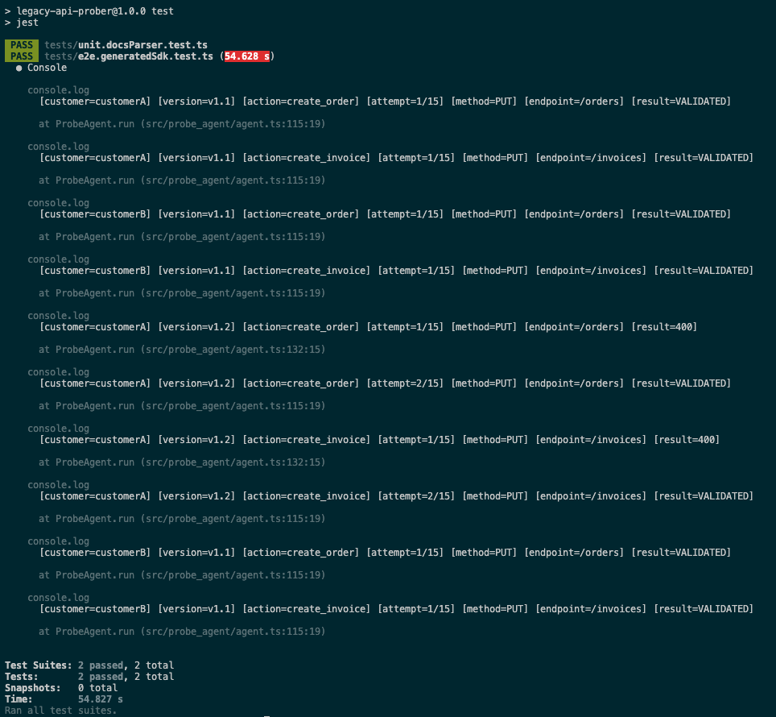

# Legacy API Prober (TypeScript)

This repository demonstrates an LLM-driven API probing tool that discovers how to interact with a legacy API and generates a working TypeScript SDK that supports multiple API versions.

## What it does

- Runs two simulated legacy API servers:
  - v1.1 at http://localhost:4011
  - v1.2 at http://localhost:4012
- Reads plain-text API documentation from `docs/`
- Uses a ReAct loop to probe endpoints until a requested business action succeeds
- Validates success by reading back the created record and comparing fields
- Generates a TypeScript SDK under `generated/sdk` using discovered contracts
- Includes automated tests covering both versions and an upgrade scenario

## Requirements

- Node.js 18+ (for built-in `fetch`)
- Install dependencies:

## Legacy system simulation specifics
This project simulates a legacy system using two independent HTTP servers (separate versions) and in-memory data stores:
- Two versions, two servers
  - src/legacy_api/server_v1_1.ts listens on port 4011
  - src/legacy_api/server_v1_2.ts listens on port 4012
- No database
  - Orders and invoices are stored in memory using Maps in src/legacy_api/data.ts
- Actions
  - For this demo, 2 actions, Orders and invoices can be created and read back:
    - PUT /orders → { "id": "..." }, then GET /orders/:id
    - PUT /invoices → { "id": "..." }, then GET /invoices/:id
- Error responses
  - 401 unauthorized
  - 400 bad_request
  - 404 not_found
- Drift between versions
 - Auth drift: v1.2 requires X-Api-Key and X-Client-Token (v1.1 requires only X-Api-Key)
 - Documentation drift: v1.2 documentation includes newer parameter names but the live server behavior does not match the newest names

## API probing strategy
The probing tool is implemented as a ReAct loop:
- For each (customer, action) pair, the probe agent runs up to 15 attempts.
- On each attempt, the LLM receives:
  - Documentation text (all docs in docs/)
  - Customer configuration (installed version, base URLs, credentials)
  - The requested action (create_order or create_invoice)
  - Previous attempts and previous HTTP responses
- The LLM outputs exactly one JSON decision:
  - method, endpoint, headers, payload, notes
- The system executes the request 
- If the write succeeds (201 with an id), the system validates by:
  - reading the record back via GET /{entity}/:id
  - checking the returned record matches the written fields
- The probe stops early on validation success; otherwise it continues until the attempt budget is exhausted.


Key files:
- Agent loop: src/probe_agent/agent.ts
- HTTP execution: src/probe_agent/executor.ts
- Validation: src/probe_agent/validator.ts
- Prompts: src/llm/prompts.ts
- OpenAI client: src/llm/OpenAILLMClient.ts

## SDK generation strategy

SDK generation is deterministic and does not use the LLM.

1. After probing completes, the tool writes a discovered profile:
  - generated/profile.json

2. The generator reads the profile and renders TypeScript code from templates:
  - generated/sdk/index.ts
  - generated/sdk/adapters/v1_1.ts
  - generated/sdk/adapters/v1_2.ts

3. The SDK exports stable functions:
  - createOrder(customerConfig)
  - createInvoice(customerConfig)

4. At runtime, the SDK selects the correct adapter based on customerConfig.installedVersion.

Key files:

- Generator: src/sdk_codegen/generateSdk.ts
- Templates: src/sdk_codegen/templates.ts
- Types: src/sdk_codegen/types.ts

## Testing strategy

There are two test layers:
1. Docs parser unit test
  - tests/unit.docsParser.test.ts
  - Confirms docs include required parameter name variants and auth header names (so the prober is allowed to try them).

2. End-to-end generated SDK test
  - tests/e2e.generatedSdk.test.ts
  - Starts both legacy servers in-process.
  - Runs the probe to generate generated/profile.json and generated/sdk/*.
  - Imports the generated SDK and executes createOrder and createInvoice.
  - Simulates an upgrade by changing customerA.installedVersion from v1.1 to v1.2, then re-running the probe to regenerate the SDK.
  - Confirms:
    - customerA works after upgrading to v1.2
    - customerB continues to work on v1.1

Run tests:
```bash
npm test
```


## Generated outputs

Successful probe runs generate:
- generated/profile.json
- generated/sdk/*

## Important Commands

```bash
npm install
```

Run servers
```bash
npm run dev:servers
```

## Run the probe CLI
The probe reads `data/customers.json`, `data/actions.json`, and the docs in `docs/`.

```bash
npm run probe
```
Environment variables:
- `LLM_PROVIDER=openai` uses OpenAI API (requires `OPENAI_API_KEY`)
- `LLM_PROVIDER=mock` uses a deterministic local model for development and tests

Example:

```bash
LLM_PROVIDER=mock npm run probe
```
Optional debug output:
- Set PROBE_DEBUG=1 to print per-attempt request/response debug blocks.
- Default is off to keep npm test output fast and to avoid timeouts.

Example:
```bash
PROBE_DEBUG=1 LLM_PROVIDER=openai OPENAI_API_KEY=... npm run probe
```